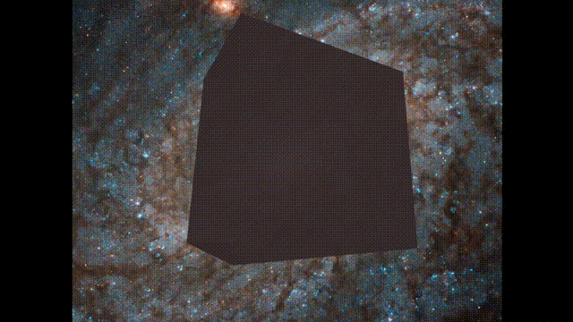

## Vim³

Most people use vim in two stupid dimensions. But not me. I use it in three:

<p align="center">
  
</p>

To run it, [install Nim](https://nim-lang.org/install.html), and from this repo do:

```
nimble run vim3
```

Once you're ready to start using it as your main editor, do:

```
nimble install paravim
nimble install
```

As long as `~/.nimble/bin` is on your PATH, you will now be able to open files like this:

```
vim3 path/to/myfile.txt
```

## Q & A

### How do i acquire your power?

It's not that hard

### How do i stop the cube from spinning

no

### I don't even have vim installed, how is this possible?

It's using [paravim](https://github.com/paranim/paravim) which has a real copy of vim built in

### Which OS does it work on?

All of them pretty much

### Why can't i run it on linux?

Could be you need opengl libraries, try `sudo apt install xorg-dev libgl1-mesa-dev`

You might also need to do `sudo apt install libtinfo5`

### I use arch btw

Try this: `sudo ln -s /usr/lib/libtinfo.so.6 /usr/lib/libtinfo.so.5`
